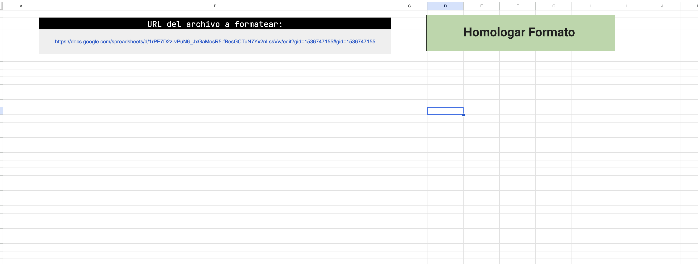
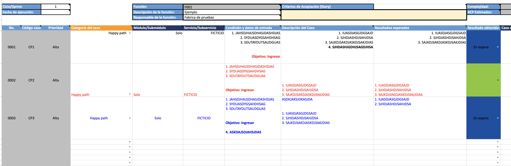
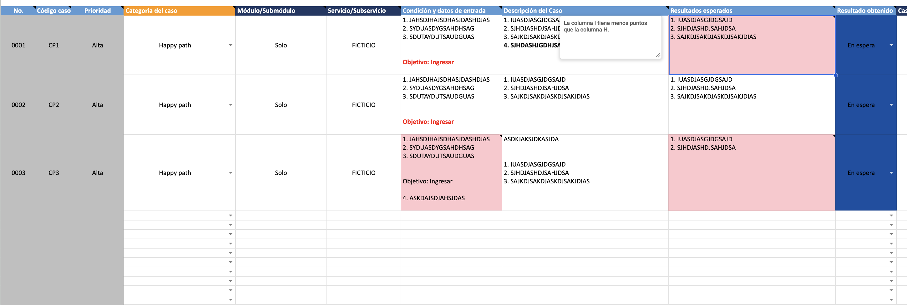
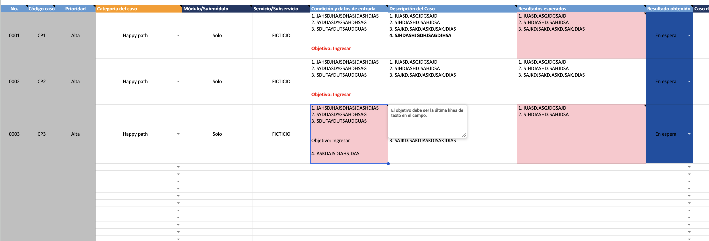

# 🚀 QA Test Case Formatter & Validator (C204)

## 📌 Descripción del Proyecto

Este proyecto es una herramienta de automatización desarrollada en **Google Apps Script (JavaScript)** diseñada para auditar, estructurar y validar lógicamente matrices de casos de prueba en Google Sheets. 

Como Analista QA, identifiqué que la revisión de estándares de formato y la validación cruzada de pasos vs. resultados esperados consumía una cantidad significativa de tiempo operativo. Esta solución automatiza el proceso de auditoría, eliminando el error humano en el diseño de pruebas y garantizando que los entregables cumplan con estrictos criterios de calidad antes de su ejecución.

## ⚙️ Características Técnicas y Funcionalidades

* **Validación Lógica con Expresiones Regulares (Regex):** El script extrae y compara dinámicamente el número de pasos a seguir contra el número de resultados esperados. Si detecta una discrepancia, inyecta una nota explicativa en la celda correspondiente para el diseñador de la prueba.
* **Auditoría de Sintaxis mediante Rich Text:** Analiza el contenido interno de las celdas para garantizar que etiquetas obligatorias (como "Objetivo") se encuentren en la posición correcta (última línea). Aplica estilos diferenciados (negrita y color rojo) a fragmentos de texto específicos usando la clase `RichTextValue`.
* **Manejo Dinámico del DOM (Sheets API):** Estandariza tipografía, alineación, ajuste de texto y auto-redimensionamiento de filas iterando sobre grandes volúmenes de datos mediante arrays multidimensionales para optimizar el rendimiento.
* **Alertas Visuales de Calidad (Conditional Formatting Code):** Evalúa filas en busca de campos vacíos obligatorios y aplica formatos condicionales (resaltado en rojo `#FFC7CE`) para prevenir la fuga de información crítica en el diseño de la prueba.
* **Ejecución Remota Segura:** Implementa un bloque `try...catch` y validaciones de interfaz de usuario (UI) para procesar archivos de forma remota a través de su URL, protegiendo la ejecución accidental.

## 📈 Impacto del Proyecto (ROI) y Escalabilidad

* **Eficiencia Operativa:** Ahorro comprobado de **80 horas mensuales** en tareas de auditoría manual de formatos y cuadre lógico para un equipo core de 10 QA Testers. 
* **Aumento de Calidad:** Reducción del **60%** en devoluciones de casos de prueba (C204) por errores de estructura, campos obligatorios vacíos o discrepancia entre pasos y resultados.
* **Proyección de Escalabilidad:** Arquitectura diseñada para un despliegue global. Al implementarse en toda la Fábrica de Pruebas, el impacto estimado asciende a más de **400 horas mensuales** liberadas, transformando el esfuerzo administrativo en tiempo efectivo de testing funcional.
* **Estandarización Corporativa:** Garantía de un formato 100% homogéneo y blindado contra el error humano para las entregas finales al cliente.

## 🛠️ Tecnologías Utilizadas

* **Lenguaje:** JavaScript (ES5 / Google Apps Script)
* **APIs:** SpreadsheetApp API, Document UI API
* **Lógica Avanzada:** Regex, Arrays 2D, Manipulación de metadatos de celdas.

## 📸 Demostración Visual

*(Nota: Los datos mostrados en las imágenes son ficticios/anonimizados para proteger la confidencialidad).*

**1. Consola de Ejecución Remota**
> Interfaz donde el usuario introduce la URL objetivo y confirma la ejecución para evitar sobreescrituras accidentales.

**2. Matriz Original (Antes del Formateo)**
> Estado base del documento sin formato estandarizado ni validaciones lógicas.

**3. Detección de Errores Lógicos (Pasos vs Resultados)**
> El algoritmo identifica discrepancias numéricas y advierte al diseñador mediante notas anidadas y formato de color.

**4. Formateo y Validación Rich Text**
> Corrección automática de estructura, alineaciones, y revisión de la posición de la etiqueta objetivo.

---
*Este proyecto fue desarrollado como iniciativa propia para mejorar la eficiencia de los procesos de Quality Assurance y demostrar el valor de la automatización en tareas operativas.*
* **Estandarización Corporativa:** Garantía de un formato 100% homogéneo y blindado contra el error humano para las entregas finales al cliente.
